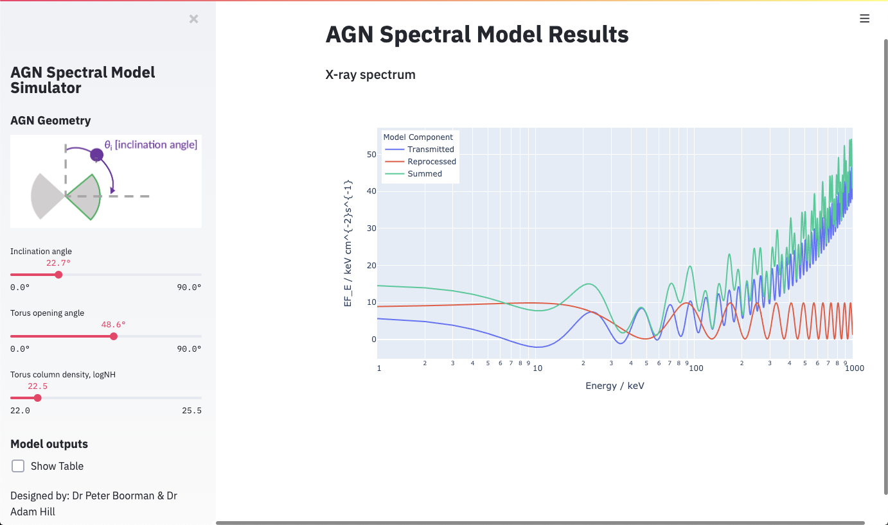

# AGN Spectra App
A streamlit app to generate X-ray spectra for different AGN modelling geometries.

## Interactive spectral generation
When launched the app should provide an interface as illustrated below that will allow the user to generate an X-ray spectral model of an AGN.


## Usage
Run
```console
streamlit run app.py
```
